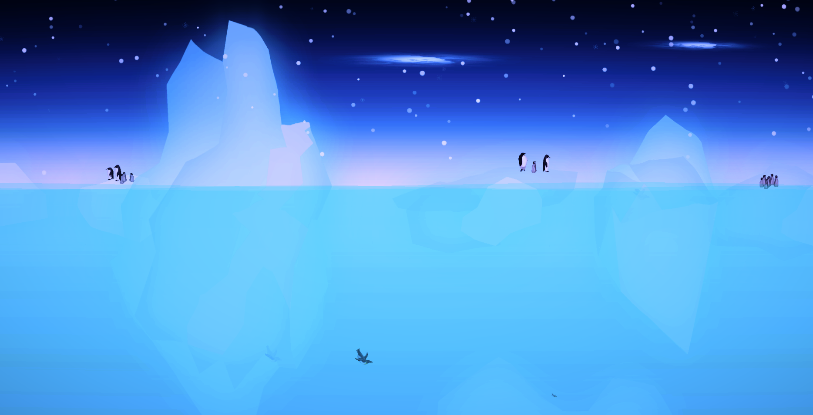

# 🚀 ShipJumper

**ShipJumper** is a fast-paced mobile platformer where you play as a tiny, determined ship leaping between dynamic terrain in vibrant, ever-changing biomes. From icy arctic waters to tropical reefs and polluted neon cityscapes, your mission is simple: **jump, dodge, and survive**.

Now available on **iOS** and **Android**, ShipJumper combines precise, physics-based motion with a stunning low-poly art style across a variety of hand-crafted worlds.

---

## 📱 Platform

- 📲 Mobile App: **iOS & Android**
- 🎮 Built with **Unity**
- 🌐 Published under **Doohickey Inc.**

---

## 🕹️ Gameplay Overview

⛴️ **Control a tiny ship** navigating a dangerous world of moving platforms  
🧊 **Jump between icebergs, boats, and junk islands**  
🔥 **Avoid obstacles** like fireballs, falling crates, and collapsing debris  
🌍 **Travel through unique worlds**, each with distinct mood, music, and mechanics  
🏁 **Survive and beat your high score** in an endless, reflex-driven loop

Easy to pick up, hard to master — perfect for mobile play.

---

## 🌎 Worlds & Biomes

Each level is crafted to feel distinct in both mood and gameplay:

### ❄️ **World 1 – The Arctic**
- **Surface**: Penguin colonies, drifting icebergs, northern lights  
- **Underwater**: God rays, icy terrain, ancient aircraft wreckage  
- **Seafloor**: Pink goo moss, glowing kelp, frozen fossils  

### 🌊 **World 2 – Stormy Atlantic**
- **Surface**: Rain, lightning, crashing waves  
- **Underwater**: Sardine swarms, whales, kelp forests  
- **Seafloor**: Mossy ruins, turbulent currents  

### 🏝️ **World 3 – Coral Paradise**
- **Surface**: White sand, parrots, floating islands  
- **Underwater**: Tropical fish, crystal water  
- **Seafloor**: Glowing coral caves  

### 🏙️ **World 4 – Toxic Cityscape**
- **Surface**: Floating garbage, fireworks, neon skyline  
- **Underwater**: Mutated sea monsters, chemical goo  
- **Seafloor**: Ancient machine ruins

### 🌸 **World 5 – Sakura Rapids**
- **Surface**: Koi fish, cherry blossoms, mountain temples  
- **Underwater**: Cranes, mystical mist, lanterns  
- **Seafloor**: Glowy ponds, giant life tree, spiritual sanctuaries  

---

## 🧩 Key Features

- 🛠️ Physics-based jump mechanics  
- 🌈 Five unique worlds with layered surface/water/seafloor progression  
- 🎨 Rich low-poly visual style, inspired by nature and fantasy  
- 🔄 Procedural hazards like crates, lightning, or falling junk  
- 🔊 Custom soundtrack and sound FX for each biome  
- 🏆 Endless scoring loop with increasing difficulty

---

## 📸 Screenshot

> World 1 – The Arctic. Penguins, auroras, and ice... what could go wrong?

---

## 🛠️ Tech Stack

- **Game Engine**: Unity (C#)  
- **Design**: Figma, moodboards, Pinterest palettes  
- **Deployment**: iOS TestFlight / Google Play  
- **UX/UI**: Minimalist, mobile-first  
- **World Building**: Excel-based level planning + hand-tuned environments

---

## 👤 My Role

As creator and lead developer, I:

- Designed the multi-biome structure and progression system  
- Developed the core gameplay and procedural logic in Unity  
- Led all UX/UI design and visual moodboarding  
- Created and animated dynamic hazards and scenery  
- Published and tested across both major mobile platforms  
- Maintained gameplay balance and player feedback tuning

---

## 📦 Download

> Currently available via Google Playstore * iOS App Store

- 📲 *(Add App Store / Play Store links)*  
- 🔄 (mailto:hello@agilan.io)

---

## 📜 License & Status

This project is developed by **Doohickey Inc.** and actively maintained as part of an original mobile game portfolio. Future updates will expand on the biome system and introduce new mechanics.

© 2020–2025 Doohickey Inc. All rights reserved.

---

## 📬 Contact

Designed by [Agilan Sivakumaran](https://agilan.io)  
🔗 [GitHub](https://github.com/agilancan) | [LinkedIn](https://www.linkedin.com/in/agilan-sivakumaran/)
